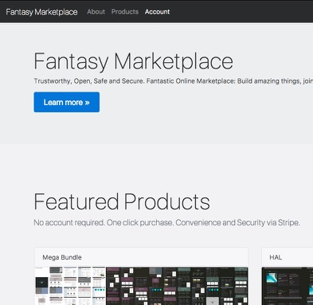
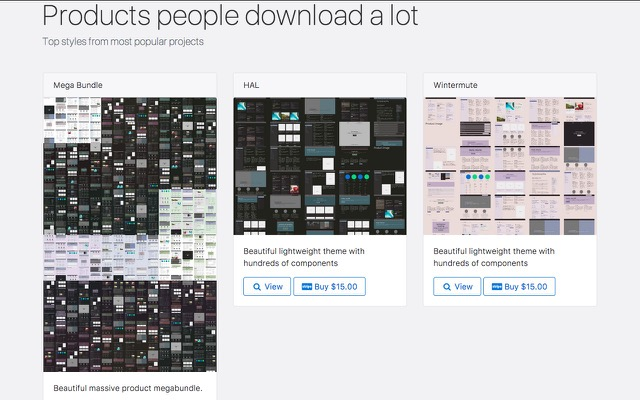

# online-marketplace
A wise and secure online marketplace for selling files. online-marketplace safely encodes purchase information in urls (AES(bcrypt-hash)) and performs operations via automated, interactive email system.






## Theory of operation, what problem does it fix, and do people have them?

In short we must ask, if it is possible to sell digital goods without forcing the user to create an account. If this is in deed, possible; then as a corollary: Why are we forcing the users to signup if it is not necessary.

There are no pros that could possibly outweigh the problems associated with a server breach, the legal repercussions that follow, and even the development of the features and flows to capture [PII](https://en.wikipedia.org/wiki/Personally_identifiable_information) in the first place.

In the age of secure off-site (Stripe) 3rd party payment processors, signups (username/password) are not always necessary to run an online business. Username/Password invariably induces the need for other [PII](https://en.wikipedia.org/wiki/Personally_identifiable_information) such as e-mail address to verify the claimed user identity and later to reset password. This relationship will then call for first and last name and later possibly address/ID where email is insufficient means of verification.

At this point we must ask, is all of this necessary. Customer information is an enormous liability in several domains. Legal ([PII](https://en.wikipedia.org/wiki/Personally_identifiable_information) privacy laws), Software Vulnerabilities and Network Security. Additionally, we must also consider convenience. Sometimes a customer just wants the product.zip file without creating accounts and going through the extra effort that comes with it. Customers passing a security check on Stripe/PayPal should not sign-up the second time to the website, especially if they don't need to (in the larger sense, when trading money for service).

---

## Security

- Customer Privacy and Server Security first.
- Minimal attack surface.
- Server does not store e-mails in readable form (hash values only).
- Credit card processing via Stripe or similar.

## Structure

- Simple product catalog (package.json format) see [product-catalog](https://github.com/fantasyui-com/product-catalog).
- Potential for serving static pages (generate from live and serve via static)

## Secrets/Key Disclosure (requires full server breach)

### STRIPE_SECRET_KEY (allows access to parts of Stripe)

Stripe secret key, used to execute API commands on Stripe.com.

- If disclosed "Your secret API key can be used to make any API call; most notably, it can create new charges or refund existing payments. However, it cannot be used to retrieve any extremely sensitive data like your customer’s credit card numbers, which we’ll never reveal in our API." see [Stripe Questions](https://support.stripe.com/questions/what-happens-if-my-api-key-is-compromised)
- Instantly mitigated by rolling new keys.

### DOWNLOAD_SECRET_KEY (prevents magnet link disclosure)

Secret Download Key used to encrypt re-download link.

- If disclosed, it will be possible to decrypt the download link.
- Instantly mitigated by changing the secret download key.

### DOWNLOAD_SECRET_SALT (prevents magnet link forgery)

Secret salt in decrypted link information.

- If disclosed it is possible to tamper with the download link. It will be possible to forge a link that will allow arbitrary product downloads. Note this requires DOWNLOAD_SECRET_KEY disclosure.
- Instantly mitigated by changing secret salt.

## Development Status

See TODO.md

[](https://nodei.co/npm/online-marketplace/)
[](https://nodei.co/npm/online-marketplace/)

## Installation

```sh

mkdir my-online-marketplace
cd my-online-marketplace/
git clone https://github.com/fantasyui-com/online-marketplace.git .
npm i
npm start

```

at this point you will see [http://0.0.0.0:8080/](http://0.0.0.0:8080/)
navigate to the address to view the homepage.


## Start Server

Use default npm (uses server.js)

```sh

npm start;

```

## Periodic Updates

Use default npm command

```sh

npm update;

```

## Development

Clone repository, install supervisor ```npm install -G supervisor``` and then:

```sh

npm run watch;

```

## Running Tests

Test system uses mocha.

```sh

npm test;

```

# Production

## Using in Production

### Installing node and pm2 for production

```sh

curl -o- https://raw.githubusercontent.com/creationix/nvm/v0.33.1/install.sh | bash
export NVM_DIR="$HOME/.nvm"; [ -s "$NVM_DIR/nvm.sh" ] && \. "$NVM_DIR/nvm.sh"  # This loads nvm
nvm install node # node installed
npm i -g pm2 # pm2 installed

```

### Installing marketplace for production

```sh

cd ~
git clone https://github.com/fantasyui-com/online-marketplace.git
cd online-marketplace/
npm i;

```

### Using a Process manager (pm2) to manage the server:

```sh

cd ~
pm2 start online-marketplace/server.js
pm2 save

```
### Environment Variables

You MUST set three ENV variables ```STRIPE_PUBLISHABLE_KEY```, ```STRIPE_SECRET_KEY```, ```DOWNLOAD_SECRET_KEY```, and ```DOWNLOAD_SECRET_SALT``` example:

```sh

STRIPE_PUBLISHABLE_KEY=pk_test_6pRNASCoBOKtIshFeQd4XMUh \
STRIPE_SECRET_KEY=sk_test_BQokikJOvBiI2HlWgH4olfQ2 \
DOWNLOAD_SECRET_KEY=sk_test_c40aeeb535784f3fa179b107c5ee8e99 \
DOWNLOAD_SECRET_SALT=st_test_784f3fa179b3f3f50a7c5faeeb5ee87c \
node server.js

```

### Process JSON

If you choose to use pm2 you can activate the provided process.json via ```$> start online-marketplace/process.json``` please remember to update and guard the secret keys.

```json

{
  "apps": [

    {

    "name": "online-marketplace",
    "script":"server.js",
    "cwd":"/home/meow/online-marketplace",

    "env": {

      "STRIPE_PUBLISHABLE_KEY" : "pk_test_6pRNASCoBOKtIshFeQd4XMUh",
      "STRIPE_SECRET_KEY"      : "sk_test_BQokikJOvBiI2HlWgH4olfQ2",
      "DOWNLOAD_SECRET_KEY"    : "sk_test_c40aeeb535784f3fa179b107c5ee8e99",
      "DOWNLOAD_SECRET_SALT"   : "st_test_784f3fa179b3f3f50a7c5faeeb5ee87c",
      }

    }

  ]
}


```
